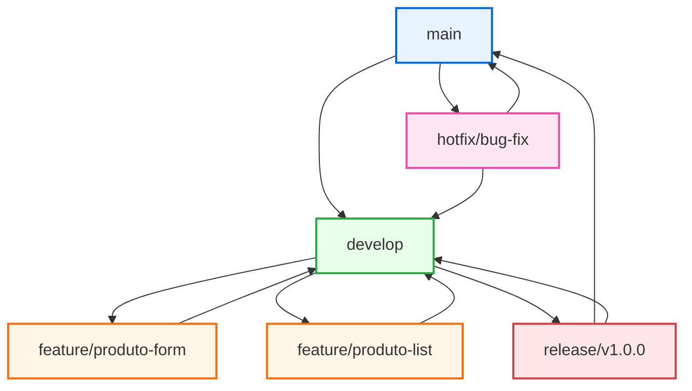

# Revisão Geral - React

## 📚 Sobre o Projeto

Este projeto foi desenvolvido durante a **Aula 3 (Aula Final)** como uma revisão geral dos principais conceitos do React. O foco foi consolidar conhecimentos fundamentais e explorar técnicas avançadas para desenvolvimento de aplicações web modernas.

## 🎯 Programa de Ensino

**Instituição:** SENAI  
**Programa:** Lab365  
**Turma:** FuturoDEV [Joinville] V4

## 🛠️ Tecnologias Utilizadas

- **React** - Biblioteca principal para construção da interface
- **React Router** - Navegação entre páginas
- **React Hook Form** - Gerenciamento de formulários
- **Material-UI (MUI)** - Biblioteca de componentes visuais
- **Vite** - Ferramenta de build e desenvolvimento
- **LocalStorage** - Persistência de dados no navegador

## 📖 Conceitos Abordados

### Hooks Fundamentais
- **useState** - Gerenciamento de estado local
- **useEffect** - Efeitos colaterais e ciclo de vida

### Persistência de Dados
- **LocalStorage** - Armazenamento local para manter dados entre sessões

### Roteamento
- **React Router** - Navegação SPA (Single Page Application)

### Formulários
- **React Hook Form** - Validação e controle de formulários
- **Função `reset()`** - Resetar formulários e popular dados para edição

### Gestão de Código
- **GitFlow** - Metodologia para gerenciamento de branches

#### Estratégia de Branches (GitFlow)



## 🔍 Ponto de Destaque

### Utilização do `reset()` do React Hook Form

Um dos principais focos da aula foi o uso avançado da função `reset()` do React Hook Form, que permite:

1. **Resetar formulários** após submissão
2. **Popular dados existentes** para edição
3. **Melhorar a experiência do usuário** ao atualizar registros

```javascript
// Exemplo de uso do reset() para popular dados
const { reset } = useForm();

// Carregar dados para edição
useEffect(() => {
  if (produto) {
    reset({
      nome: produto.nome,
      preco: produto.preco,
      categoria: produto.categoria
    });
  }
}, [produto, reset]);
```

## 📁 Estrutura do Projeto

```
src/
├── pages/
│   ├── Produtos/          # Listagem de produtos
│   ├── NovoProduto/       # Cadastro de novos produtos
│   └── EditarProduto/     # Edição de produtos existentes
├── routes/
│   └── index.jsx          # Configuração das rotas
├── App.jsx                # Componente principal
└── main.jsx              # Ponto de entrada da aplicação
```

## 🚀 Como Executar

1. Clone o repositório
2. Instale as dependências:
   ```bash
   npm install
   ```
3. Execute o projeto:
   ```bash
   npm run dev
   ```

## 📝 Funcionalidades

- ✅ Listagem de produtos
- ✅ Cadastro de novos produtos
- ✅ Edição de produtos existentes
- ✅ Persistência de dados no LocalStorage
- ✅ Navegação entre páginas
- ✅ Formulários com validação
- ✅ Interface responsiva com Material-UI

## 🎓 Aprendizados

Este projeto serviu como consolidação dos conhecimentos adquiridos no curso, demonstrando a integração entre diferentes tecnologias do ecossistema React e boas práticas de desenvolvimento frontend.

---

**Desenvolvido durante o Lab365 - SENAI Joinville V4** 🚀
